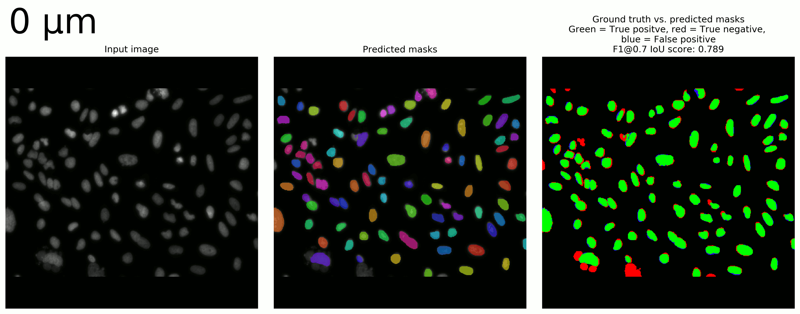

# DeepQIBC - Deep learning Quantitative Image-Based Cytometry

DeepQIBC (Quantitative Image-Based Cytometry) is a program that aims to equip researchers with the ability to utilise deep learning algorithms to detect nuclei within multichannel microscopy images through a user-friendly interface. By utilising deep learning, DeepQIBC aims to be versatile and requires minimal setup in nuclei detection by being independent of cell type, microscope or magnification used.
 
 

#### Adjustable settings
A drawback of deep learning is its enduring desire for computing power, particularly in the realm of high resolution microscopy image analysis. DeepQIBC aims to address this by offering users 3 computation requirement levels: Low, Medium and High. By reducing the computation requirement, these options can help to reduce the computational load on a user's machine and enable the curious to test how deep learning algorithms work with their images. Quantification of how these varying computational levels perform can be found in the **(((STATS SECTION)))**. Moreover, DeepQIBC was developed and tested entirely on a ThinkPad X230 (i5-3320M, 16GB RAM), which is ~9 years old, demonstrating that DeepQIBC can be used on older hardware and offer initial insight prior to more thorough analysis.
 
 

#### Data exploration
Following the identification of nuclei, DeepQIBC records pixel intensities across all channels within the identified nuclei and this data can be saved. Additionally, DeepQIBC also enables the user to gain initial insight into the recorded data. This is achieved by providing a gallery of the input images with the detected nuclei objects superimposed over the original image, allowing the user to determine if image segmentation has been successful. Additionally, DeepQIBC provides initial insight into the recorded data in a scatter plot. The axes, limits and point colours of these plots can be swiftly changed and allows for the delineation of heterogeneous single cell data into defined populations, such as cell cycle stage. This can enable users to determine, for example, the accumulation of a particular marker, such as DNA damage, in a specific phase of the cell cycle.

Click below for a video demonstrating the workflow of DeepQIBC:

## Setting up DeepQIBC
DeepQIBC uses Mask R-CNN to identify nuclei (https://github.com/matterport/Mask_RCNN).

## DeepQIBC measurements

| Intensity reading      | Description |
| --------------------- | ----------- |
| object_number         | Number of identified nuclei      |
| area                  | Pixel area of identified nuclei     |
| mean_intensity        | Mean pixel intensity per identified nuclei      |
| total_intensity       | Total pixel intensity per identified nuclei         |
| min_intensity         | Minimum pixel intensity per identified nuclei        |
| max_intensity         | Maximum pixel intensity per identified nuclei        |
| std_intensity         | Standard deviation of pixel intensities inside an identified nuclei |
| edge_mean_intensity   | Mean pixel intensity at edge of identified nuclei    |
| edge_total_intensity  | Total pixel intensity at edge of identified nuclei        |
| edge_min_intensity    | Minimum pixel intensity at edge of identified nuclei        |
| edge_max_intensity    | Maximum pixel intensity at edge of identified nuclei        |
| edge_std_intensity    | Standard deviation of pixel intensities at edge of identified nuclei        |

## Testing DeepQIBC performance

DeepQIBC was tested in the detection of nuclei in three image sets in order to give an example of how it performs across different cell types and magnifications. These image sets are:

 - Human colon-cancer cells (HT29)
 - Small cells
 - Out of focus osteosarcoma cells (U-2 OS)

However, a limitation of these tests were that the high setting was unable to be assessed. All development and analysis was performed on the CPU of a ThinkPad X230 (i5-3320M, 16GB RAM) which was unable to run the predicted to ground-truth object matching algorithm on high settings. Hopefully in future, DeepQIBC can be tested on a more powerful system in order to get better insight into how the high setting performs in comparison to the others.

In the figures below, predicted objects that overlap with ground-truth objects have been coloured `green`. Ground-truth objects that fail to be detected by DeepQIBC have been coloured `red`. Areas that have been predicted by DeepQIBC to contain a nuclei but have no matching ground-truth object are coloured `blue`.

<!-- OOF U2OS -->
## Out of focus images of human osteosarcoma cells

In high-content imaging applications, the autofocus of a microscope may fail to accurately find the correct focal plane. This can lead to images that are out of focus to varying degrees. DeepQIBC was used to detect osteosarcoma cell nuclei that were in and out of focus (OOF) at varying levels (0, 8, 16, 24 and 32 µm z-plane). While it is interesting to examine how DeepQIBC performs in detecting out of focus images, it is important to note that out of focus images can corrupt quantitative results (i.e. OOF images are an outlier), particularly in time-course experiments. Filtering out extremely OOF images through an additional quality control step should be implemented for any high-content imaging application since DeepQIBC could erroneously identify severely OOF images. Quality control could involve using a supervised machine learning classifier on a range of extracted nuclei features (e.g. edge/STD intensity) for images that are in and out of focus.

Images were from the imageset BBBC006 from the Broad Bioimage Benchmark Collection (Ljosa et al., Nature Methods, 2012). Specifically, the image `mcf-z-stacks-03212011_a17_s1_w1` was used and manually annotated using VGG Image Annotator (VIA, https://www.robots.ox.ac.uk/~vgg/software/via/). The ground-truth objects were determined at the 0 µm z-plane only.

### OOF images with DeepQIBC low settings:

### OOF images with DeepQIBC medium settings:

**"Why does the medium setting at 32um show an F1 score of 0 despite having identified nuclei?"** 
The F1 score displayed is for objects that have an IoU value of 0.7, thus in the 32um image, no predicted nuclei possess an overlap with a ground-truth nuclei greater than an IoU of 0.7.

### F1 score measured at multiple IoU thresholds at various levels of focus using medium settings:

<!-- small cells -->
## Small cells

The various computation settings (low, medium and high) of DeepQIBC, in essence, rely on rescaling of image dimensions. As a result, the low setting rescales images to 512x512 (original image aspect ratio is maintained but 'padded' to a square with empty pixels), resulting in small objects being made even smaller. Additionally, a limitation of the currently trained model is that images with very small objects were not used, thus the deep learning algorithm is not very good at identifying these objects.

For example, at medium settings the cell objects are ~20 px in diameter. When using low settings, these objects are ~10 px in diameter and such small objects lose resolution in the neural network when subsampling. This is why the increase in image size associated with the medium and high settings should aid detection of small cells.

Images were form the imageset BBBC004v1 from the Broad Bioimage Benchmark Collection (Ljosa et al., Nature Methods, 2012), which are synthetic images. Specifically, `9GRAY000` was used.

### Identification of small cells using the low setting:

### Identification of small cells using the medium setting:

### F1 score measured at multiple IoU thresholds in detecting small cells at low and medium settings

<!-- HT29 -->
## Human colon-cancer nuclei detection

DeepQIBC was tested in the detection of heterogeneous nuclei in an image of human colon-cancer cells (HT29). In samples like these, you can often find very varied nuclei morphologies and cells that are close to one another.

Images were form the imageset BBBC008v1 from the Broad Bioimage Benchmark Collection (Ljosa et al., Nature Methods, 2012), which are synthetic images. Specifically, `AS_09125_050116000001_A24f00d0_slice2_channel1.tif` was used and manually annotated using VGG Image Annotator (VIA, https://www.robots.ox.ac.uk/~vgg/software/via/)

### Identification of colon-cancer nuclei using the low setting:

### Identification of colon-cancer nuclei using the medium setting:

### F1 score measured at multiple IoU thresholds in detecting colon-cancer nuclei at low and medium settings

## Next steps
While recording pixel intensities within a defined region (e.g. a nuclei object) is simple, the application of deep learning to generate these identified masks is abstract to the end user, such as a researcher. Here, DeepQIBC aims to make the application of deep learning algorithms to biological images simple and intuitive. Future work could aim to extend the image types identified by DeepQIBC (DAPI-stained nuclei) to a wider range of biological sample types, as was achieved in the Kaggle Data Science Bowl 2018 (NATURE REF).

While DeepQIBC only identifies nuclei, future work could also begin to identify other morphological features of cells. Deep learning could identify subtle features within images and find relationships between features that would not otherwise be assessed by a researcher. This in part would be enabled by the extraction of vast swathes of data from biological images by deep learning and enable researchers to exploit new discrepancies or trends within their data. However, it is imperative that the tools that are developed in this area are user-friendly, offer intuitive data analysis and visualisation.
